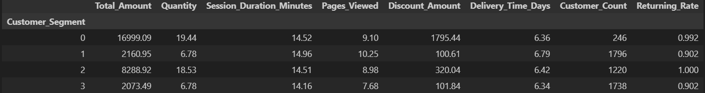
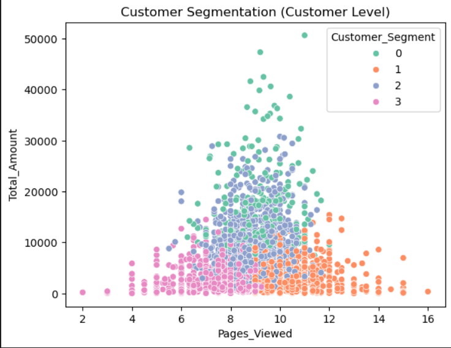
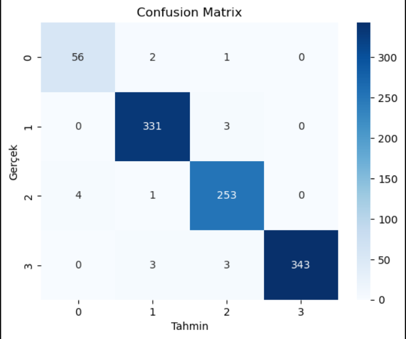
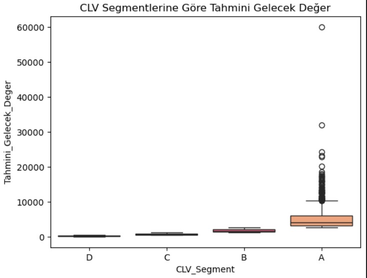
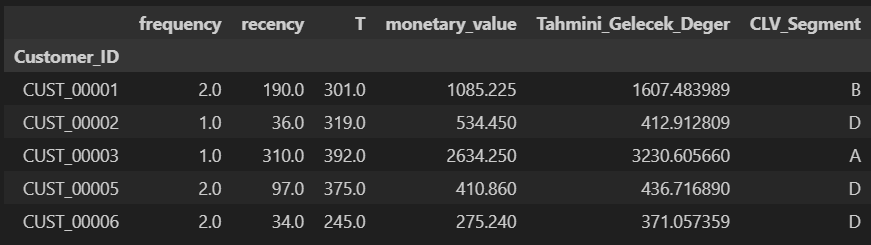

# 📊 E-Ticaret Müşteri Analizi  
## Müşteri Segmentasyonu, Derin Öğrenme ve CLV Analizi

## 📌 Proje Özeti
Bu projede, e-ticaret müşterilerinin davranışsal ve işlemsel verileri kullanılarak  
**müşteri segmentasyonu**, **derin öğrenme ile segment tahmini** ve  
**Müşteri Yaşam Boyu Değeri (Customer Lifetime Value – CLV)** analizi gerçekleştirilmiştir.

Çalışma; K-Means kümeleme, yapay sinir ağları (MLP) ve olasılıksal CLV modellerini
tek bir uçtan uca veri bilimi sürecinde birleştirmektedir.

---

## 🧠 Kullanılan Yöntemler
- Customer-Level Feature Engineering  
- K-Means Clustering  
- Deep Learning (MLP) ile Segment Sınıflandırma  
- Clustering Evaluation Metrics (DB, CH)  
- BG/NBD & Gamma-Gamma ile CLV Analizi  

---

## 🔎 Adım Adım Model Çıktıları

### 1️⃣ Müşteri Segment Analizi
K-Means algoritması ile müşteriler 4 segmente ayrılmıştır.  
Her segment için ortalama davranış metrikleri ve returning customer oranları hesaplanmıştır.

---

### 2️⃣ Müşteri Segmentasyonu Görselleştirmesi
Müşterilerin segmentlere göre toplam harcama ve sayfa görüntüleme dağılımı:

---

### 3️⃣ Derin Öğrenme ile Segment Tahmini
Oluşturulan müşteri segmentleri, çok katmanlı yapay sinir ağı (MLP) kullanılarak
tahmin edilmiştir.

#### Confusion Matrix

Model çıktıları:
- Accuracy
- Precision, Recall, F1-Score
- Classification Report

---

### 4️⃣ Müşteri Yaşam Boyu Değeri (CLV) Analizi
BG/NBD ve Gamma-Gamma modelleri kullanılarak müşterilerin 6 aylık
gelecekteki yaşam boyu değerleri tahmin edilmiştir.

#### CLV Segment Dağılımı

---

### 5️⃣ En Yüksek CLV’ye Sahip Müşteriler
Tahmini gelecekteki değeri en yüksek olan ilk 10 müşteri:

---

## 📈 Değerlendirme Metrikleri
- Davies–Bouldin Index  
- Calinski–Harabasz Index  

Bu metrikler, elde edilen segmentlerin ayrışma ve tutarlılığını
nicel olarak değerlendirmek için kullanılmıştır.

---

## 🚀 Sonuç
Bu çalışma, müşteri segmentasyonunu derin öğrenme ve CLV analizi ile
destekleyerek yalnızca mevcut müşteri davranışlarını değil,
aynı zamanda **gelecekteki müşteri değerini** de tahmin eden
kapsamlı bir veri bilimi çözümü sunmaktadır.
